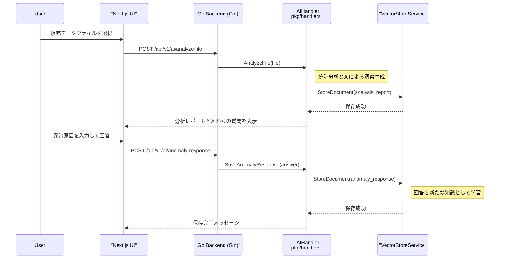
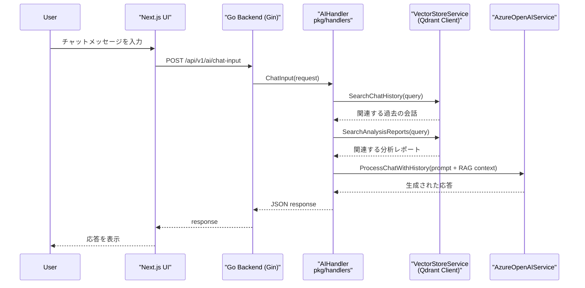
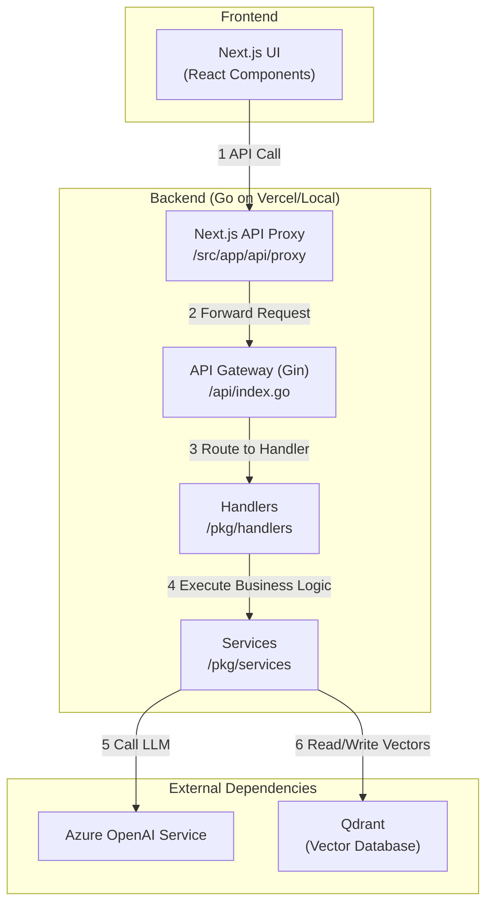
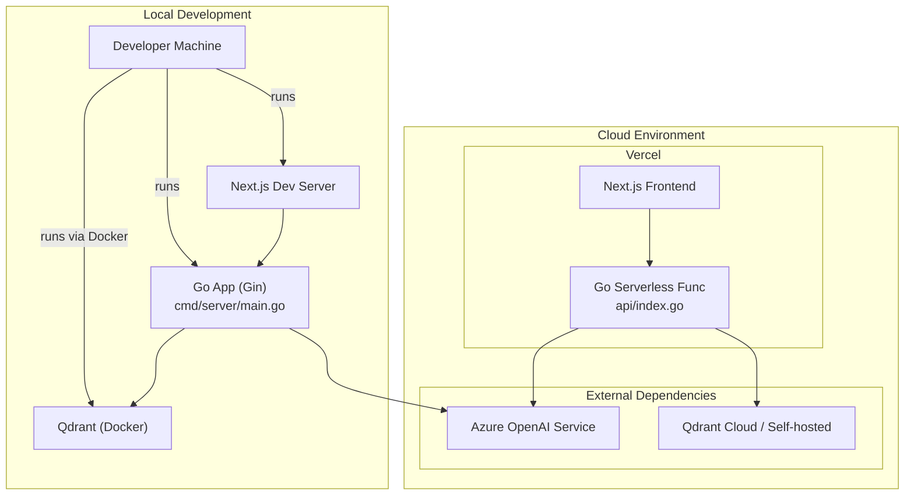

# AI技術ハンズオンレポート：実践的RAGシステムの分析

**氏名:** 〇〇 〇〇
**日付:** 2025年10月16日

## 1. はじめに


本レポートは、Next.jsとGoで構築されたAIチャットアプリケーション「hunt-chat-api」を題材に、その中核をなすRAG（Retrieval-Augmented Generation）アーキテクチャと継続的学習の仕組みを、実際のコードを交えて分析・報告する。


---

## 2. やったこと・動かしたものの概要

分析対象は、販売データ分析を支援するAIチャットAPIサーバーである。このプロジェクトは、主に以下の3つの先進的なAI機能を実装している。

- **ファイル分析とレポート生成:** アップロードされた販売データ（Excel/CSV）を統計分析し、AIによる洞察を加えたレポートを生成する。
- **RAGによるAIチャット:** 生成されたレポートや過去の対話履歴をベクトルデータベース（Qdrant）から高速に検索し、その情報を基にAIが正確な応答を生成する。
- **異常検知と継続的学習:** データから売上の異常を検知し、その原因をユーザーに質問。回答を新たな知識として蓄積し、AIを継続的に賢くする。


---

## 3. 具体的な手続き（コードによる実装分析）

バックエンドはGo言語で構築され、主要なAIロジックは `pkg/handlers/ai_handler.go` に集約されている。

### (1) ファイル分析とRAGのためのデータ準備

`AnalyzeFile`ハンドラは、アップロードされたファイルを分析し、後で検索できるよう結果をベクトルデータベースに保存する。これはRAGにおける「Indexing（索引付け）」のプロセスに相当する。

- **コード抜粋 (Go):**
    ```go
    // pkg/handlers/ai_handler.go より抜粋
    func (ah *AIHandler) AnalyzeFile(c *gin.Context) {
        // ... ファイル読み込みと統計分析処理 ...

        // 分析レポートを作成
        report, _ := ah.statisticsService.CreateAnalysisReport(...)

        // レポートをJSON化し、Qdrantに非同期でベクトルデータとして保存
        go func() {
            reportJSON, _ := json.Marshal(report)
            ah.vectorStoreService.StoreDocument(
                ctx, "hunt_chat_documents", report.ReportID, string(reportJSON), metadata,
            )
        }()

        c.JSON(http.StatusOK, gin.H{"success": true, "analysis_report": report})
    }
    ```


### (2) RAGによるAIチャット応答

`ChatInput`ハンドラでは、ユーザーの質問に対し、Qdrantから関連情報を検索（Retrieval）し、それを基に応答を生成（Generation）する。

- **コード抜粋 (Go):**
    ```go
    // pkg/handlers/ai_handler.go より抜粋
    func (ah *AIHandler) ChatInput(c *gin.Context) {
        // RAG: ユーザーの質問を基に、ベクトルDBから関連情報を検索
        var ragContext strings.Builder
        chatHistory, _ := ah.vectorStoreService.SearchChatHistory(ctx, req.ChatMessage, ...)
        analysisResults, _ := ah.vectorStoreService.SearchAnalysisReports(ctx, req.ChatMessage, ...)
        // ... 検索結果をragContextに結合 ...

        // AIに応答を生成させる（元の質問 + RAGコンテキスト）
        aiResponse, _ := ah.azureOpenAIService.ProcessChatWithHistory(
            req.ChatMessage,
            ragContext.String(),
            relevantHistoryTexts,
        )

        c.JSON(http.StatusOK, gin.H{"success": true, "response": ...})
    }
    ```



### コンポーネント図




### デプロイ図 — ローカル開発とVercel本番環境

説明: ローカルでの開発環境と、Vercelと外部サービスで構成される本番環境の関係を示します。




---

## 4. わかったこと・わからなかったこと

### (1) わかったこと

- **RAGの実装:** ベクトルDB（Qdrant）とGoのAPIを組み合わせることで、RAGが具体的にどう実装されるかをコードレベルで理解できた。情報の「索引付け」と「検索」が中核をなす。
- **Human-in-the-Loopの価値:** ユーザーからのフィードバックをベクトルDBに蓄積する仕組みは、AIを継続的に成長させる強力な学習ループであることを学んだ。
- **ドキュメントと実装の同期の重要性:** 開発の現場ではコードが最新の仕様書であり、ドキュメントをコードと同期させ続けることの重要性と難しさを実感した。

### (2) わからなかったこと（この講義で解消したいこと）

- 検索精度を最大化するための、最適なテキストの分割（チャンキング）戦略。
- キーワード検索とベクトル検索を組み合わせた「ハイブリッド検索」の具体的な実装方法。
- RAGシステムの性能（検索精度や回答の正確性）を定量的に評価し、改善するための体系的な手法。


