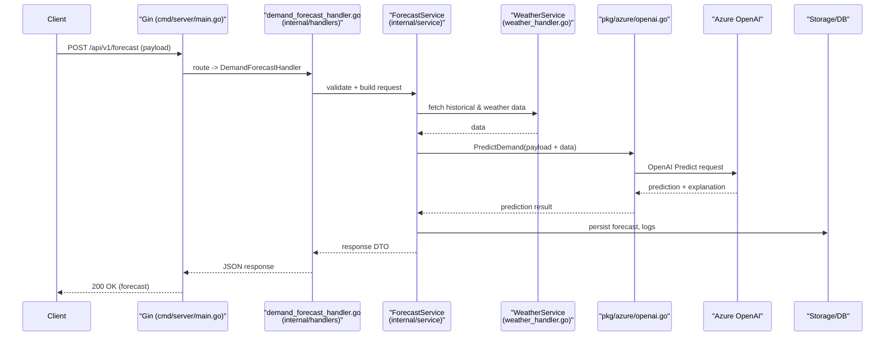
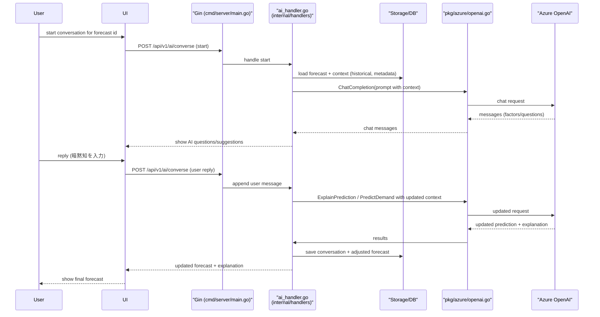
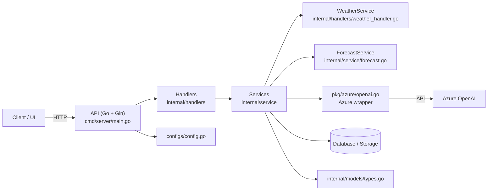
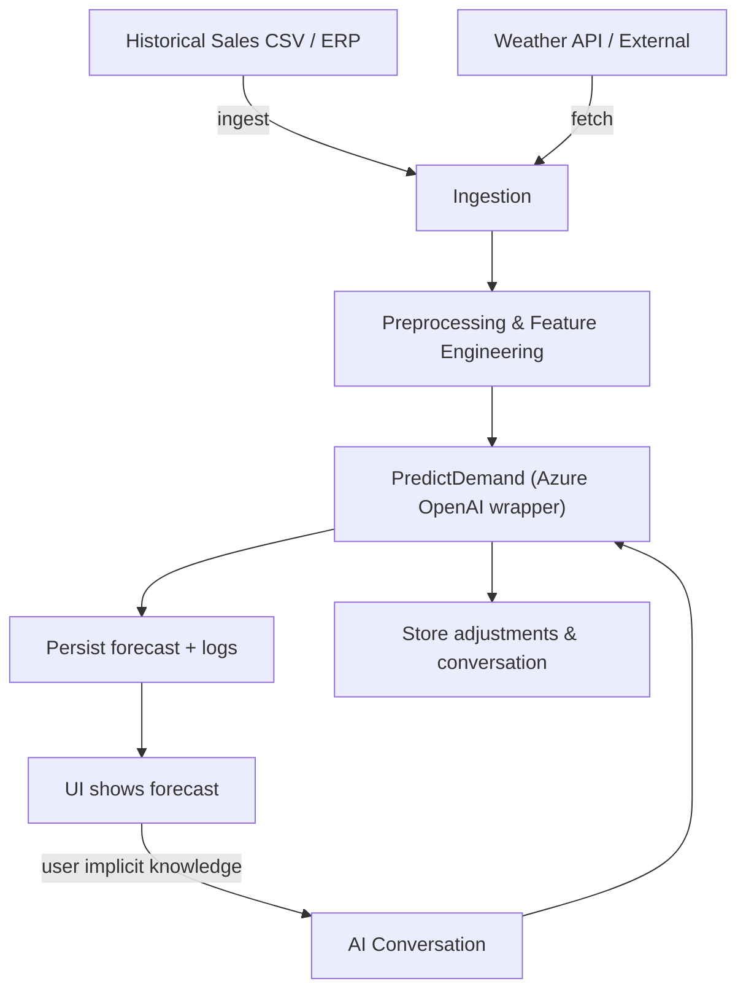
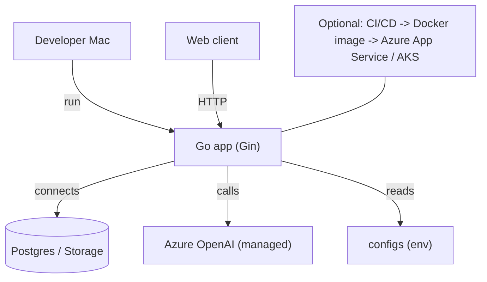

## UML & アーキテクチャ図

このファイルはプロジェクトの主要なアーキテクチャ図をまとめたものです。図ごとに短い日本語の説明と、該当するソースファイルを明記しています。

目次

- シーケンス図（予測リクエスト）
- シーケンス図（AI対話ワークフロー）
- コンポーネント図（高レベル構成）
- データフロー図（DFD レベル1）
- デプロイ図（開発環境と外部サービス）

---

### シーケンス図 — 需要予測リクエスト

説明: クライアントが需要予測をリクエストしてから、ForecastService が Azure OpenAI に頼んで予測を生成し、結果を永続化して返すまでの流れです。

主な参照ファイル: `cmd/server/main.go`, `internal/handlers/demand_forecast_handler.go`, `internal/service/forecast.go`, `pkg/azure/openai.go`

### シーケンス図 — AI 対話（暗黙知取得／調整）

説明: 既存の予測に対して AI とユーザーの対話を行い、暗黙知を取り込んで予測を再計算・保存する流れです。対話は会話履歴を保存しながら行います。

主な参照ファイル: `internal/handlers/ai_handler.go`, `pkg/azure/openai.go`, 永続化コード（DB周り）

### コンポーネント図 — 高レベルの責務分離

説明: サービス間の責務と主要モジュールを示します。開発者がどのファイルに関心を持てばよいか分かるようにしました。

主な参照ファイル: `cmd/server/main.go`, `internal/handlers/*`, `internal/service/*`, `pkg/azure/openai.go`, `configs/config.go`, `internal/models/types.go`

### データフロー図（DFD レベル1）

説明: 外部データ（販売実績、天気）を取り込んで前処理し、予測モデル（Azure を利用）へ流し、UI と対話を通じてフィードバックを戻す高レベルなデータフローです。

主な参照: データ取り込み・前処理ロジック、`pkg/azure/openai.go` の予測呼び出し

### デプロイ図 — 開発環境と外部サービス

説明: ローカル開発と外部依存（DB、Azure）の関係を示します。CI/CD パイプラインについての注記も付けています。

---

付録・使いかた

- 図は Mermaid をサポートする Markdown ビューア（VS Code プレビュー等）で確認してください。
- 追加で PlantUML 版や PNG/SVG の出力が必要なら教えてください。

