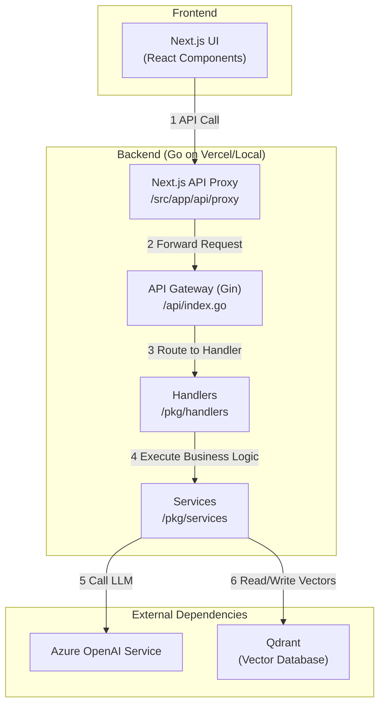
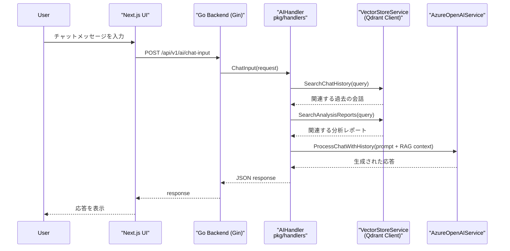
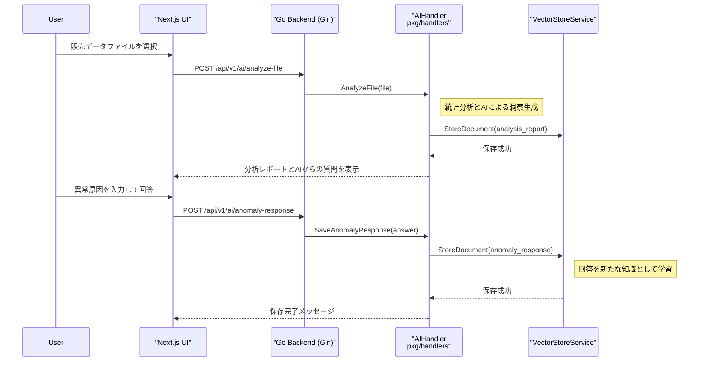
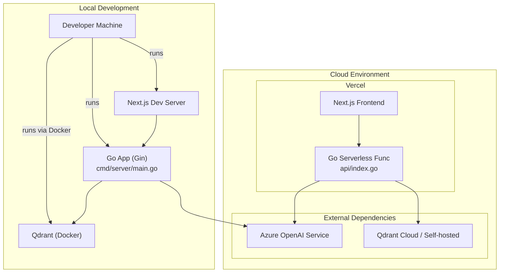

## UML & アーキテクチャ図 (v2.0)

このファイルは、現在のプロジェクト実装に基づいた主要なアーキテクチャ図をまとめたものです。図ごとに短い日本語の説明と、該当するソースファイルを明記しています。

**主な変更点 (v2.0):**
- ディレクトリ構造を `internal/` から `pkg/` に更新。
- データベースを、AI機能の中核である `Qdrant` に明記。
- 現在のRAGアーキテクチャや継続的学習のフローを反映。

目次

- コンポーネント図（高レベル構成）
- シーケンス図（RAGチャットフロー）
- シーquence図（ファイル分析と継続的学習）
- デプロイ図（ローカル開発とVercel本番環境）

---

### コンポーネント図 — 高レベル構成

説明: フロントエンド、バックエンド、外部サービス間の責務と主要モジュールを示します。バックエンドは `pkg/` 以下のハンドラ、サービスで構成され、AI機能は `AzureOpenAIService` と `VectorStoreService` (Qdrant) を中心に実現されます。

主な参照ファイル: `api/index.go`, `pkg/handlers/*`, `pkg/services/*`, `pkg/models/types.go`

### シーケンス図 — RAGチャットフロー

説明: ユーザーからのチャット入力に対し、Qdrantから関連情報を検索（RAG）してコンテキストを構築し、AIが応答を生成するまでの一連の流れを示します。

主な参照ファイル: `pkg/handlers/ai_handler.go` (ChatInput), `pkg/services/vector_store_service.go`

### シーケンス図 — ファイル分析と継続的学習

説明: ユーザーがアップロードしたファイルを分析してレポートを生成し、Qdrantに保存する流れと、その後の異常検知・ユーザーからの回答を学習データとして保存するループを示します。

主な参照ファイル: `pkg/handlers/ai_handler.go` (AnalyzeFile, SaveAnomalyResponse)

### デプロイ図 — ローカル開発とVercel本番環境

説明: ローカルでの開発環境と、Vercelと外部サービスで構成される本番環境の関係を示します。

---

付録・使いかた

- 図は Mermaid をサポートする Markdown ビューア（VS Code プレビュー等）で確認してください。

