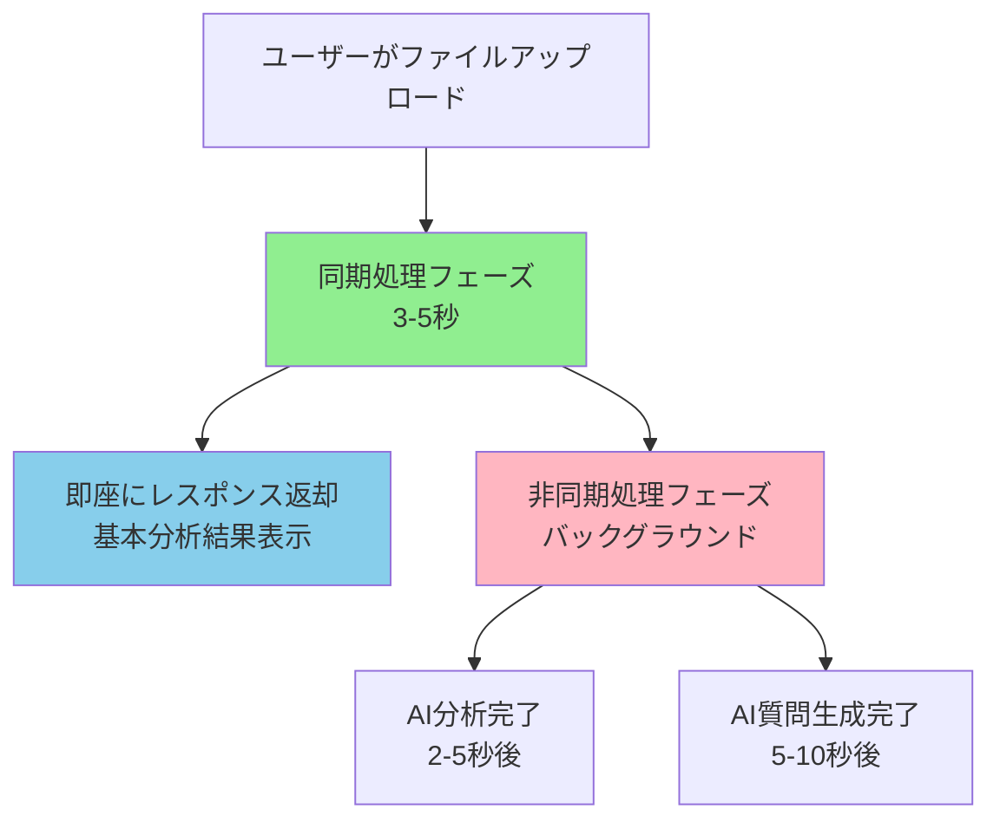
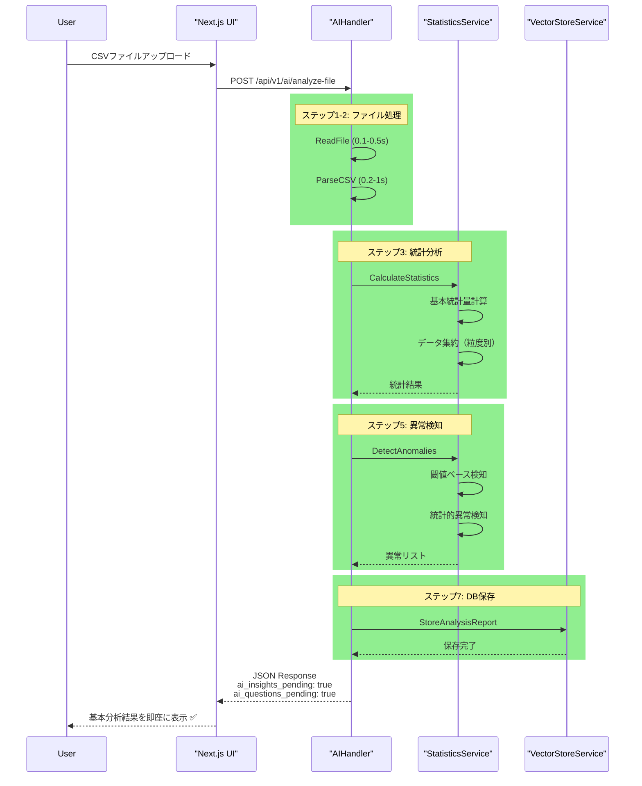
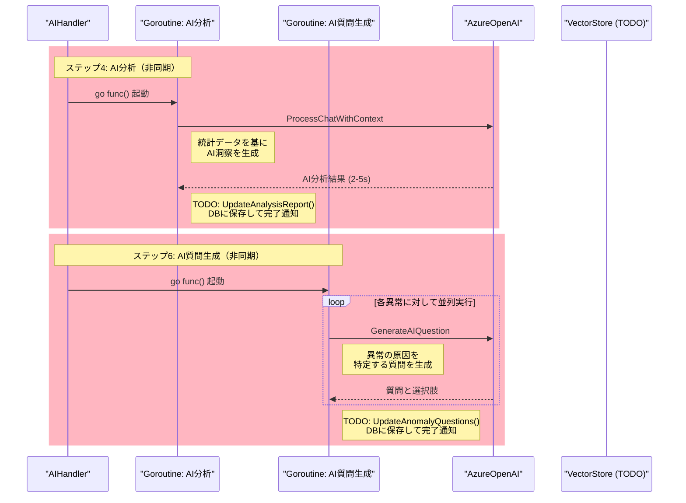
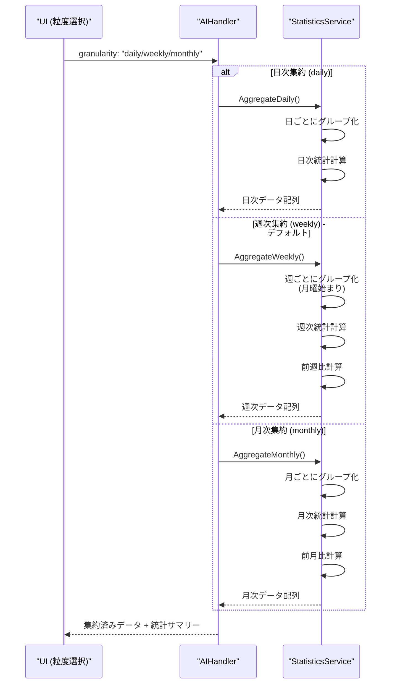
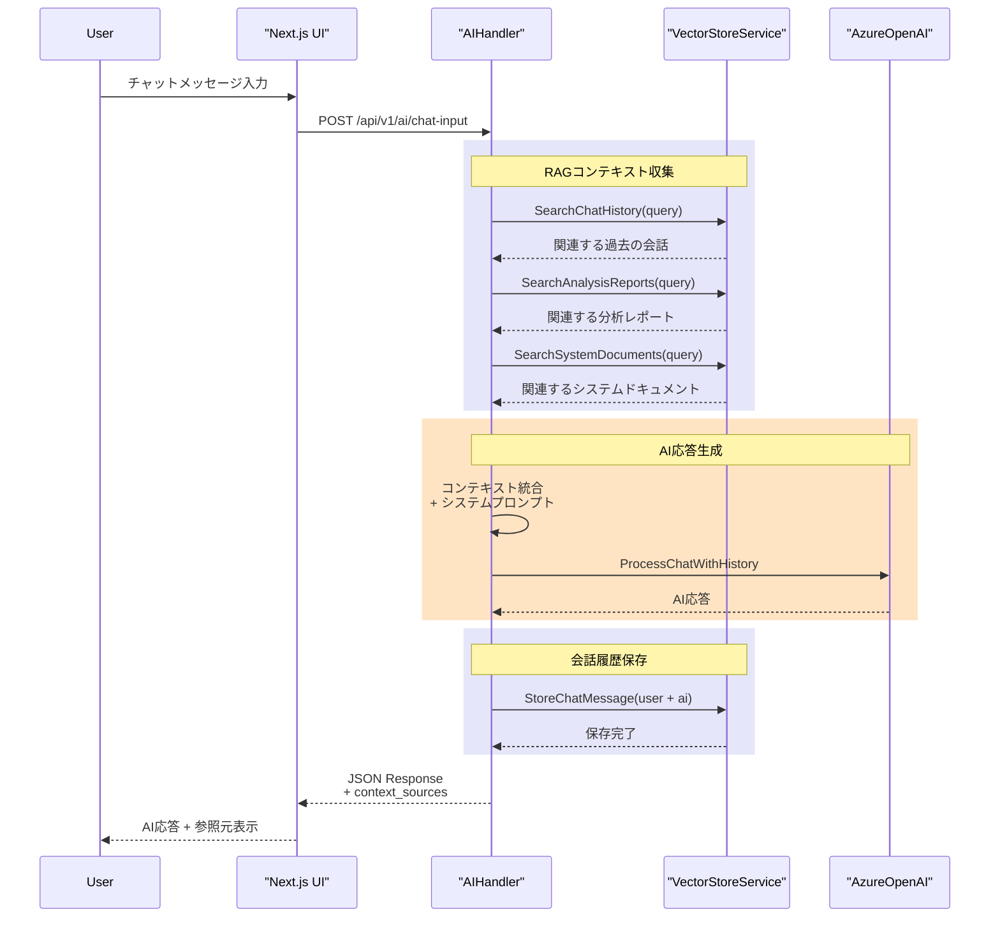
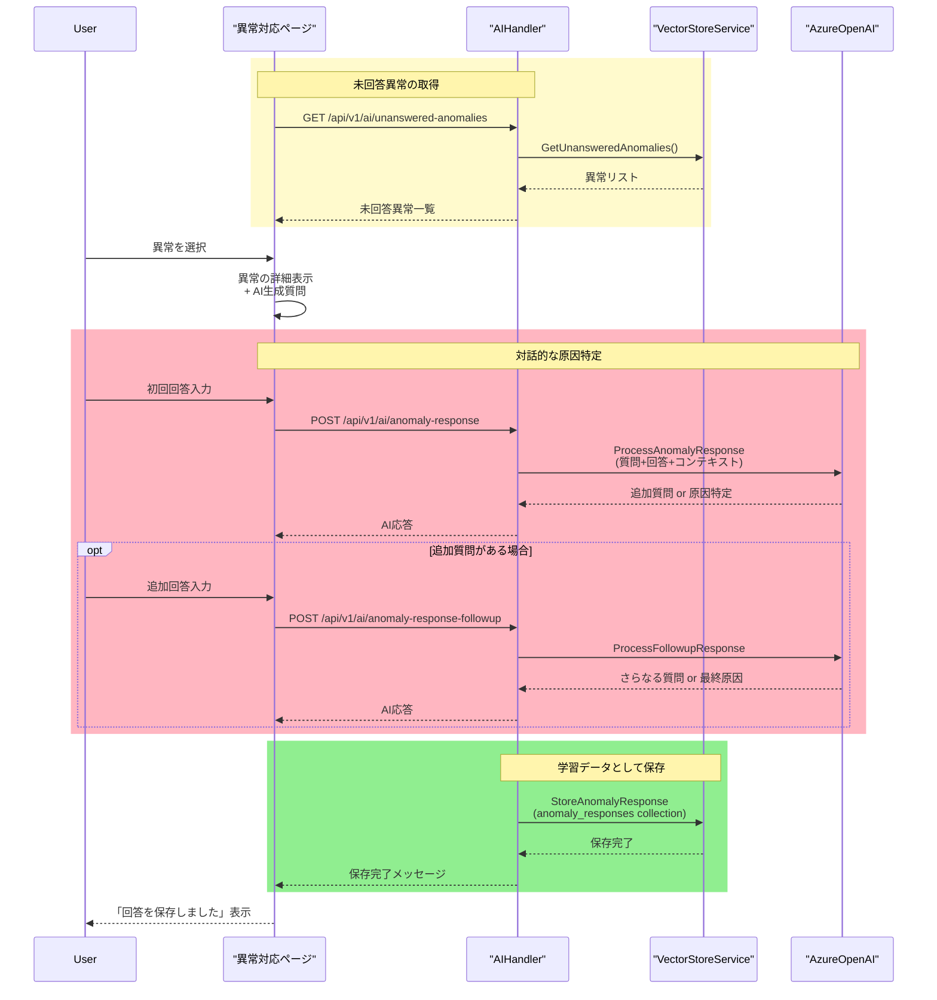
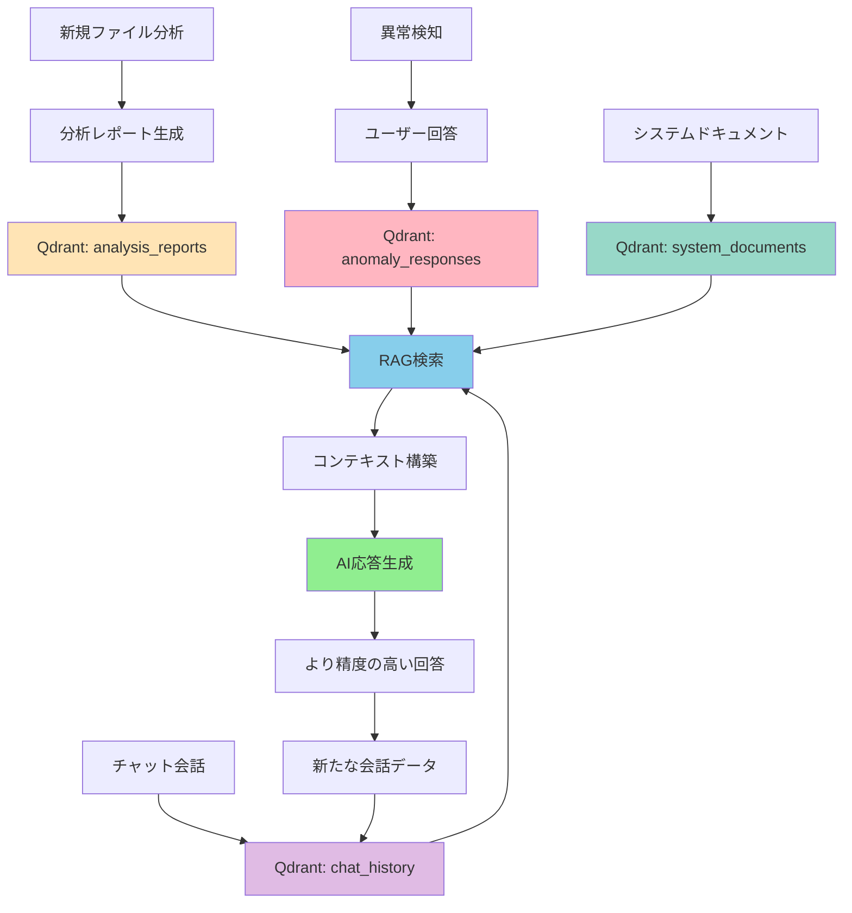
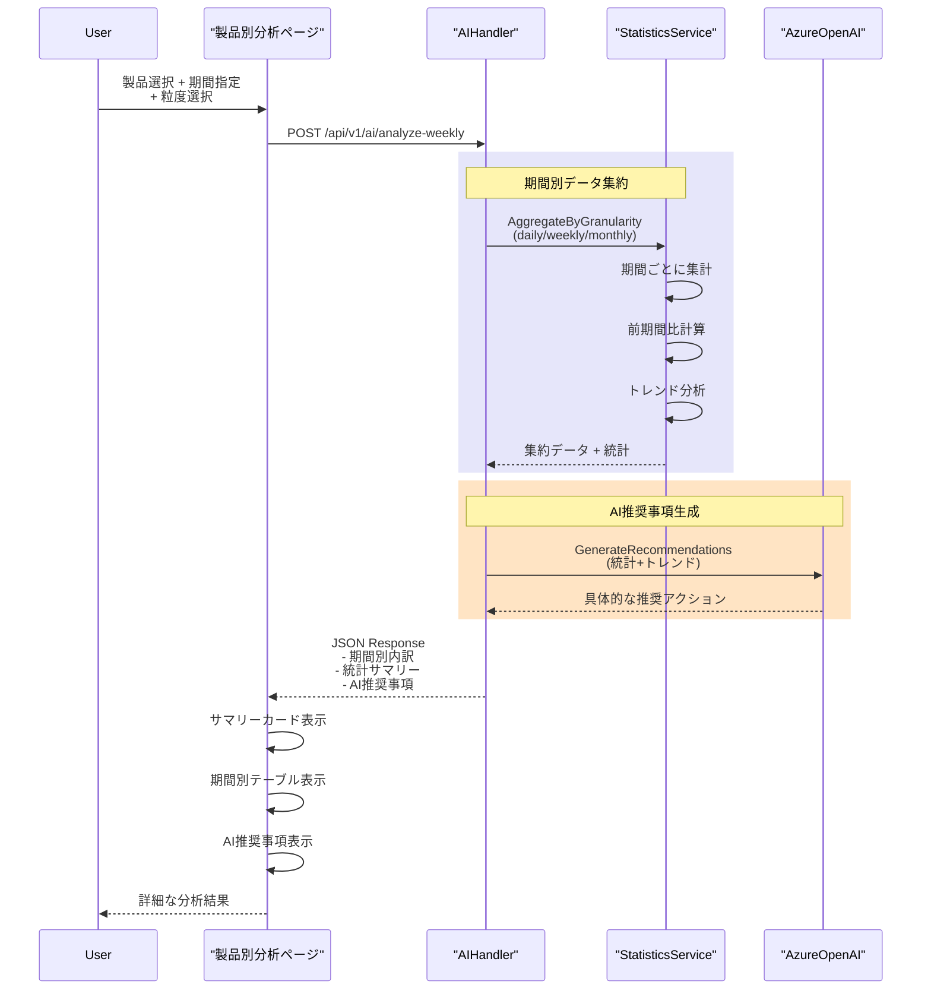
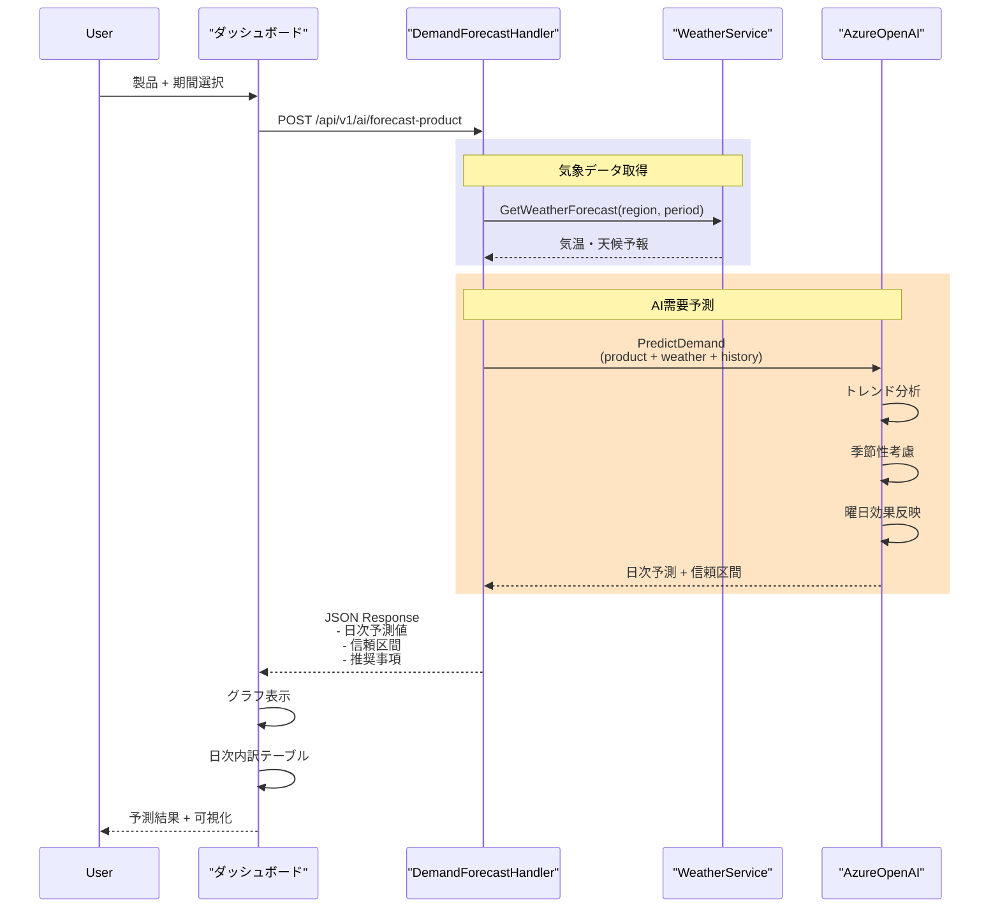

## UML & アーキテクチャ図 (v3.0)

このファイルは、現在のプロジェクト実装に基づいた主要なアーキテクチャ図をまとめたものです。図ごとに短い日本語の説明と、該当するソースファイルを明記しています。

**主な変更点 (v3.0 - 2025-10-21):**
- 処理フローを細かく分割し、個別のシーケンス図として整理
- 非同期処理の詳細フローを追加
- データ集約（日次/週次/月次）フローを追加
- 製品別分析（旧：週次分析）フローを追加
- 異常対応チャットフローを追加
- 各図を見やすいサイズに最適化

## 目次

### 1. システム全体構成
- [1-1. コンポーネント図（高レベル構成）](#1-1-コンポーネント図高レベル構成)
- [1-2. デプロイ図（ローカル開発とVercel本番環境）](#1-2-デプロイ図ローカル開発とvercel本番環境)

### 2. ファイル分析フロー
- [2-1. ファイル分析：全体フロー（概要）](#2-1-ファイル分析全体フロー概要)
- [2-2. ファイル分析：同期処理フェーズ](#2-2-ファイル分析同期処理フェーズ)
- [2-3. ファイル分析：非同期AI処理フェーズ](#2-3-ファイル分析非同期ai処理フェーズ)
- [2-4. データ集約処理（粒度選択）](#2-4-データ集約処理粒度選択)

### 3. AI機能フロー
- [3-1. RAGチャットフロー](#3-1-ragチャットフロー)
- [3-2. 異常対応チャットフロー](#3-2-異常対応チャットフロー)
- [3-3. 継続的学習フロー](#3-3-継続的学習フロー)

### 4. 分析機能フロー
- [4-1. 製品別分析フロー](#4-1-製品別分析フロー)
- [4-2. 需要予測フロー](#4-2-需要予測フロー)

---

## 1. システム全体構成

### 1-1. コンポーネント図（高レベル構成）

**説明:** フロントエンド、バックエンド、外部サービス間の責務と主要モジュールを示します。バックエンドは `pkg/` 以下のハンドラ、サービスで構成され、AI機能は `AzureOpenAIService` と `VectorStoreService` (Qdrant) を中心に実現されます。

**主な参照ファイル:** `api/index.go`, `pkg/handlers/*`, `pkg/services/*`, `pkg/models/types.go`

---

### 1-2. デプロイ図（ローカル開発とVercel本番環境）

**説明:** ローカルでの開発環境と、Vercelと外部サービスで構成される本番環境の関係を示します。

**主な参照ファイル:** `cmd/server/main.go`, `api/index.go`, `docker-compose.yml`

---

## 2. ファイル分析フロー

### 2-1. ファイル分析：全体フロー（概要）

**説明:** ファイルアップロードから分析完了までの全体像を示します。同期処理（即座にレスポンス）と非同期処理（バックグラウンド実行）の2段階構成になっています。

**主な参照ファイル:** `pkg/handlers/ai_handler.go` (AnalyzeFile)

---

### 2-2. ファイル分析：同期処理フェーズ

**説明:** ユーザーにレスポンスを返すまでの同期処理（ステップ1-7）を詳細に示します。この段階で基本的な統計分析と異常検知が完了します。

**主な参照ファイル:** `pkg/handlers/ai_handler.go`, `pkg/services/statistics_service.go`

---

### 2-3. ファイル分析：非同期AI処理フェーズ

**説明:** バックグラウンドで実行されるAI分析とAI質問生成の処理を示します。これらは並列で実行され、完了後にDBに保存されます（TODO実装）。

**主な参照ファイル:** `pkg/handlers/ai_handler.go`, `pkg/services/azure_openai_service.go`

---

### 2-4. データ集約処理（粒度選択）

**説明:** ユーザーが選択した粒度（日次/週次/月次）に応じて、データを集約する処理を示します。

**主な参照ファイル:** `pkg/services/statistics_service.go`

---

## 3. AI機能フロー

### 3-1. RAGチャットフロー

**説明:** ユーザーからのチャット入力に対し、Qdrantから関連情報を検索（RAG）してコンテキストを構築し、AIが応答を生成するまでの一連の流れを示します。

**主な参照ファイル:** `pkg/handlers/ai_handler.go` (ChatInput), `pkg/services/vector_store_service.go`

---

### 3-2. 異常対応チャットフロー

**説明:** 検出された異常に対してユーザーが原因を回答し、それを学習データとして保存するフローを示します。

**主な参照ファイル:** `pkg/handlers/ai_handler.go` (SaveAnomalyResponse), `src/app/anomaly-response/page.tsx`

---

### 3-3. 継続的学習フロー

**説明:** システム全体での継続的学習サイクルを示します。ユーザーの回答や分析結果がQdrantに蓄積され、将来のAI応答に活用されます。

**主な参照ファイル:** `pkg/services/vector_store_service.go`

---

## 4. 分析機能フロー

### 4-1. 製品別分析フロー

**説明:** 特定の製品について、日別/週別/月別の粒度で販売実績を分析するフロー（旧：週次分析ページ）。

**主な参照ファイル:** `pkg/handlers/ai_handler.go` (AnalyzeWeekly), `src/app/product-analysis/page.tsx`

---

### 4-2. 需要予測フロー

**説明:** 製品の需要予測を実行し、日次内訳と信頼区間を提供するフロー。

**主な参照ファイル:** `pkg/handlers/demand_forecast_handler.go`, `src/app/dashboard/page.tsx`

---

## 付録・使いかた

### 図の閲覧方法

- 図は Mermaid をサポートする Markdown ビューア（VS Code プレビュー等）で確認してください。
- GitHub上でも自動的にレンダリングされます。

### 図の更新ルール

1. **新機能追加時**: 該当するセクションにシーケンス図を追加
2. **処理変更時**: 既存の図を更新し、変更日をコメントで記載
3. **複雑な処理**: 概要図と詳細図に分割して可読性を保つ

### 関連ドキュメント

- [API_MANUAL.md](./API_MANUAL.md) - APIエンドポイント詳細
- [RAG_SYSTEM_GUIDE.md](./RAG_SYSTEM_GUIDE.md) - RAGシステムの詳細
- [PERFORMANCE_OPTIMIZATION_GUIDE.md](./PERFORMANCE_OPTIMIZATION_GUIDE.md) - パフォーマンス最適化
- [WEEKLY_ANALYSIS_GUIDE.md](./WEEKLY_ANALYSIS_GUIDE.md) - 製品別分析ガイド

---
